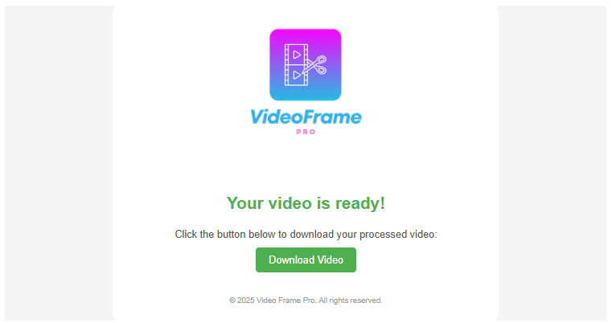
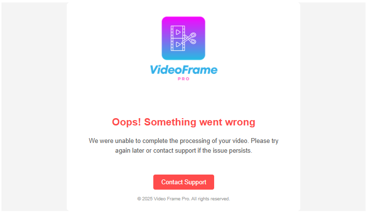

<p align="center">
  
</p>

---

Este repositório contém a implementação da **lógica de envio de e-mails** do sistema **Video Frame Pro**, responsável por notificar os usuários sobre o status do processamento de vídeos.

---

## Função

A função Lambda envia e-mails baseados no status do processamento:

1. **Sucesso**: Um e-mail contendo o link para download do vídeo processado.
   <div align="left">
      
   </div>

2. **Erro**: Um e-mail notificando que ocorreu um problema no processamento.
   <div align="left">
      
   </div>

---

## Campos da Requisição

A função Lambda espera um evento com os seguintes campos:

- **email** (obrigatório): O e-mail do destinatário.
- **frame_url** (obrigatório apenas se "error" for falso): O link para download do vídeo processado.
- **error** (opcional): Um flag booleano indicando se ocorreu um erro.

### Exemplos de Entrada

#### E-mail de Sucesso

```json
{
   "body": {
      "email": "usuario@email.com",
      "frame_url": "https://example.com/download.zip",
      "error": false
   }
}
```

#### E-mail de Erro

```json
{
   "body": {
      "email": "usuario@email.com",
      "error": true
   }
}
```

---

## Exemplos de Resposta

### Sucesso

```json
{
  "statusCode": 200,
  "body": {
      "email": "usuario@email.com",
      "frame_url": "https://example.com/download.zip"
  }
}
```

### Erro de Validação

```json
{
  "statusCode": 400,
  "body": {
    "message": "Validation failed."
  }
}
```

### Erro Interno

```json
{
  "statusCode": 500,
  "body": {
    "message": "An unexpected error occurred. Please try again later."
  }
}
```

---

## Tecnologias

<p>
  
  
  
  
  
</p>

---

## Estrutura do Repositório

```
/src
├── send
│   ├── send.py                   # Lógica de envio de e-mails
│   ├── requirements.txt          # Dependências do Python
│   ├── __init__.py               # Inicialização do pacote
/tests
├── send
│   ├── send_test.py              # Testes unitários para a função de envio de e-mails
│   ├── requirements.txt          # Dependências do Python para testes
│   ├── __init__.py               # Inicialização do pacote para testes
/infra
├── main.tf                       # Definição dos recursos AWS com Terraform
├── outputs.tf                    # Outputs das funções e recursos Terraform
├── variables.tf                  # Definições de variáveis Terraform
├── terraform.tfvars              # Arquivo com variáveis de ambiente
```

---

## Passos para Configuração

### Pré-Requisitos

1. Configure as credenciais da AWS.
2. Armazene a chave da API Brevo no SSM Parameter Store como um parâmetro seguro.

### Deploy da Infraestrutura

1. No diretório `infra`, configure o arquivo `terraform.tfvars`.
2. Execute o Terraform:

```bash
cd infra
terraform init
terraform apply -auto-approve
```

---

### Testes Unitários

1. Rode o bloco para instalar as dependências de testes, executar os testes e gerar o relatório de cobertura:

```sh
find tests -name 'requirements.txt' -exec pip install -r {} +
pip install coverage coverage-badge
coverage run -m unittest discover -s tests -p '*_test.py'
coverage report -m
coverage html  
```

## Licença

Este projeto está licenciado sob a **MIT License**. Consulte o arquivo LICENSE para mais detalhes.

---

Desenvolvido com ❤️ pela equipe Video Frame Pro.
